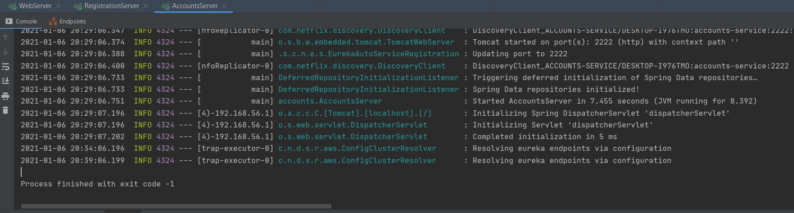

# lab6-microservices!

This is the report for **lab6-microservices**.

## The two microservices `accounts (2222)` and `web` are running and registered (two terminals, logs screenshots)

- Accounts microservice is registered in port 2222

- Web microservice is registered in port 3333

## The service registration service has these two microservices registered (a third terminal, dashboard screenshots)
- Registration service shows the first two microservices registered
	 - Registration log (port 1111)

	- Dashboard (localhost:1111)

## A second  `accounts`  microservice instance is started and will use the port 4444. This second  `accounts (4444)`  is also registered (a fourth terminal, log screenshots).

- Accounts microservice is registered in port 4444

> to do so you have to change the proper `applications.yml` with the specified port and run it in another terminal as `gradle :accounts:bootRun`

-  Registration service dashboard shows the first  two microservices registered and this new one

##  What happens when you kill the microservice  `accounts (2222)`  and do requests to  `web`?  
   

Since the `accounts (4444)` microservice is still running and registered in Eureka , the web service can provide information about accounts. 
- 
- Still working after 2222 was taken down

